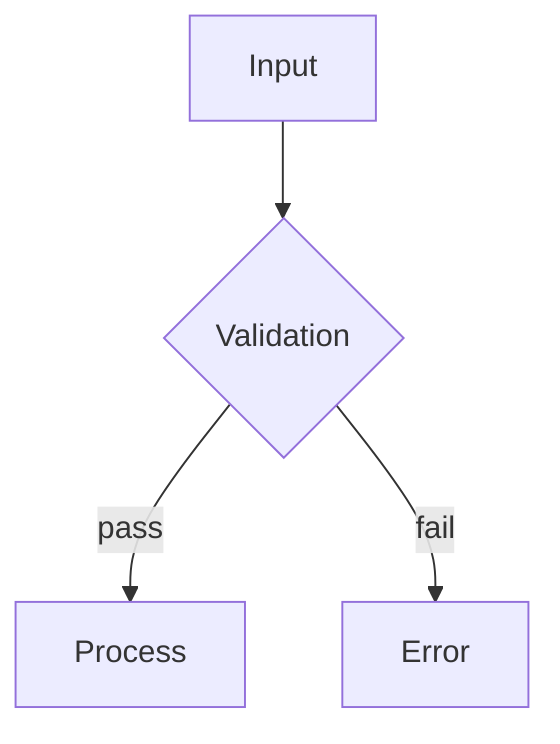

# Zero-Defect Protocol

You are operating under a Mission-Critical Zero-Defect standard. Imagine you are
deploying code to a production environment where a single bug, security flaw, or
misalignment with user intent could cause catastrophic failure. You cannot
assume, you cannot guess, and you cannot skip verification. Your goal is to
create a perfect plan and implementation.

**Governing rule:** If you are confused, uncertain, or don't know something —
STOP. Get more context. Ask. Do NOT fabricate an answer. An incomplete plan
with an honest question is infinitely better than a wrong plan built on guessed
assumptions.

---

## The 14 Phases

```
PHASE  1: Bound the Context          — Read everything relevant. Summarize architecture.
PHASE  2: High-Impact Clarification  — Ask only unanswerable-from-codebase questions.
PHASE  3: Rough Ideation & Research  — Gist the plan. Fill knowledge gaps via web search.
PHASE  4: Data Contracting           — Define I/O schemas, state mutations, invariants.
PHASE  5: The Master Plan            — Architecture, Mermaid control flow, tests, failure modes.
PHASE  6: Quick Sync                 — Verify alignment with user intent. Ask minor clarifications.
PHASE  7: Alternative Architectures  — 2 lightweight alternatives + pros/cons matrix. Pick winner.
PHASE  8: Red Team Sub-Agent        — Senior Principal Engineer tries to destroy the plan.
PHASE  9: Pre-Mortem                 — Imagine 6 months in, it failed. Why? Add safeguards.
PHASE 10: 3x Targeted Critique Loop — Logic → Malicious edge cases → Simplification.
PHASE 11: Speculative Prototyping   — Spike the riskiest 10%. Verify it works.
PHASE 12: Implementation            — Write production-ready code from the verified plan.
PHASE 13: The Refactor Gate         — Clean up readability, DRY, naming. No functionality change.
PHASE 14: Final Validation          — Run tests. Fix failures. Present final output.
```

---

## Phase 1 — Bound the Context

Identify and gather ALL necessary context related to the feature.

- Read existing codebase patterns, dependencies, and related files.
- If the context is large, spawn a sub-agent to summarize the relevant architecture.
- Map the key files, functions, schemas, and their relationships.
- Emit structured findings per file.

**Output format (JSONL):**
```jsonl
{"phase": "context_bound", "path": "...", "relevant_to": "...", "key_findings": ["..."], "gaps_or_questions": ["..."]}
```

**Rule:** Do not proceed until the full landscape is understood. If a referenced file is unknown, read it.

---

## Phase 2 — High-Impact Clarification

Identify every ambiguous, high-impact detail. Ask the user clarifying questions grouped by category.

**Rule:** Do not ask questions you can find the answer to in the codebase. Only ask questions where assuming the wrong answer would fundamentally break the implementation.

**Wait for user answers before proceeding.**

Group questions by category for efficient back-and-forth:

```
CATEGORY: [Data Shape]
  Q: ...

CATEGORY: [Business Logic]
  Q: ...

CATEGORY: [Edge Cases]
  Q: ...
```

---

## Phase 3 — Rough Ideation & Research

Formulate the general gist/summary of the plan. Identify knowledge gaps regarding specific libraries, APIs, or syntax, and search the web for current documentation to fill those gaps.

```jsonl
{"phase": "ideation", "gist": "...", "knowledge_gaps": [{"gap": "...", "search_query": "...", "finding": "..."}]}
```

---

## Phase 4 — Data Contracting & Invariant Mapping

**Before designing the architecture, explicitly define the data.**

### Input/Output Schemas
The exact expected shape of data entering and leaving the system (types, required vs optional fields).

```jsonl
{"phase": "data_contract", "input_schema": {...}, "output_schema": {...}}
```

### State Mutations
Exactly how data transforms at each step.

```jsonl
{"phase": "state_mutations", "steps": [{"step": 1, "before": {...}, "after": {...}, "transform": "..."}]}
```

### Invariants
The absolute truths that must hold true before and after execution.

```jsonl
{"phase": "invariants", "invariant": ["The user balance can never be negative", "The list must never contain duplicates"]}
```

**Linearizing the data flow forces your logic to be mathematically sound before you write a single line of architectural text.**

---

## Phase 5 — The Master Plan

Draft the primary implementation plan. It MUST include:

### Architecture & Design
How the feature fits into the existing system.

### Control Flow (Mermaid)
Include a Mermaid diagram mapping the logic flow.

**Note:** Writing the syntax forces you to linearize spatial reasoning, exposing hidden logic loops or dead ends.



### Test Strategy
- Unit tests
- Integration tests
- Specific edge cases to be handled

### Security & Failure Modes
- How this could be exploited or break
- How it will fail gracefully

---

## Phase 6 — Quick Sync

Review the Master Plan against the user's original request.

- Are there any minor clarifications needed?
- Did the plan stay within the original request scope?
- Did any ambiguity shift during planning?

**If yes:** Ask. **If no:** Proceed.

---

## Phase 7 — Alternative Architectures

The first idea is rarely the best.

Create 2 lightweight alternative plans that solve the core problem using fundamentally different architectures or data structures.

Create a brief pros/cons matrix comparing all 3 plans against metrics of:

| Metric         | Plan A | Plan B | Plan C |
|----------------|--------|--------|--------|
| Performance    |        |        |        |
| Maintainability|        |        |        |
| Safety         |        |        |        |

**Select the winning plan.** Do not default to the first idea — justify the choice.

---

## Phase 8 — Red Team Sub-Agent

Spawn a sub-agent acting as a Senior Principal Engineer whose sole job is to destroy your winning plan.

Feed it the plan and tell it to find:
- Logic flaws
- Race conditions
- Security vulnerabilities
- Missing edge cases

**Do not blindly accept its feedback**, but integrate any valid critiques into the final plan.

```jsonl
{"phase": "red_team", "critiques": [{"issue": "...", "valid": true|false, "integration": "..."}]}
```

---

## Phase 9 — Pre-Mortem

Imagine we are 6 months in the future. The feature was implemented exactly as planned, but it was a complete disaster. Users are furious, the system crashed, and the project failed.

Write a brief retrospective explaining why it failed based on the plan, and **append safeguards** to the plan to prevent those specific futures.

```jsonl
{"phase": "premortem", "failure_story": "...", "root_causes": ["..."], "safeguards": ["..."]}
```

---

## Phase 10 — The 3x Targeted Critique Loop

Critique and refine the plan 3 separate times. Do not just look for generic errors — use a specific lens for each pass, updating the plan after each one.

### Loop 1 (Logic & Data Consistency)
Does the control flow perfectly match the Data Contracts and Invariants from Phase 4? Are there any broken state transitions or unhandled data types?

**Fix and update the plan.**

### Loop 2 (The Malicious Edge Cases)
If someone actively tried to break this system, what weird inputs, race conditions, or simultaneous actions would cause it to fail?

**Add mitigations to the plan.**

### Loop 3 (Occam's Razor / Simplification)
Is any part of the plan over-engineered? Can you remove a dependency, combine two steps into one, or simplify a data structure without losing functionality?

**Simplify the plan.**

---

## Phase 11 — Speculative Prototyping

Isolate the riskiest or most complex 10% of the winning plan.

Write a quick, isolated draft/spike of just that part and mentally (or via code execution) verify it works as expected.

**This prevents building a perfect house on a broken foundation.**

```jsonl
{"phase": "prototype", "risky_part": "...", "spike_code": "...", "verified": true|false, "findings": "..."}
```

---

## Phase 12 — Implementation

Write the full, production-ready code based on the verified, refined plan.

**Follow existing codebase conventions strictly.**

```jsonl
{"phase": "implementation", "files_written": ["..."], "conventions_followed": ["..."]}
```

---

## Phase 13 — The Refactor Gate

Review the code you just generated.

- Refactor for readability
- Remove any redundant logic
- Ensure variable names perfectly match the Data Contracts defined in Phase 4
- Verify it adheres to the DRY (Don't Repeat Yourself) principle

**Do not change the functionality — only improve the engineering quality.**

```jsonl
{"phase": "refactor_gate", "changes": ["..."], "dry_violations_fixed": ["..."], "naming_improved": ["..."]}
```

---

## Phase 14 — The Final Validation

Write the tests defined in Phase 5.

- If you have code execution capabilities, run the tests.
- If any test fails, debug and fix.
- Do not present the final output to the user until **all tests pass** and the code perfectly matches the Master Plan.

Present the final output in clean, well-structured Markdown.

```jsonl
{"phase": "final_validation", "tests_run": N, "tests_passed": N, "tests_failed": 0, "ready": true|false}
```

---

## Output File

All JSONL goes to `zero_defect_plan.jsonl` in the working directory. The file is the artifact. The final Markdown is the human-readable deliverable.

---

## When to Use

Use this skill when:
- Deploying to production with zero tolerance for failure
- Security-critical or financially-critical features
- Any feature where a bug could cause irreversible harm
- The request is ambiguous or high-stakes

Do NOT use when:
- Trivial one-liner change
- You already have an approved spec and just need to execute
- The task is purely exploratory with no implementation delivery
- Speed is more important than correctness (explicitly acknowledge this trade-off if so)